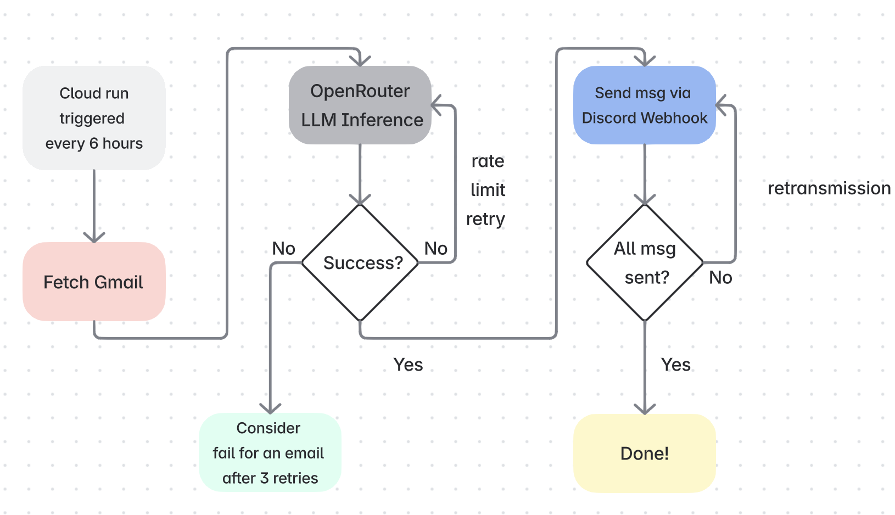

# Email Summarizer

Automated email summarizer with Discord notifications

## Video Demo
[Demo link](https://youtu.be/2GvLVeTGhtA)

## Repo Structures
```
email-summarizer/
├── README.md
├── requirements.txt
├── Dockerfile
├── deploy.sh
├── .dockerignore
├── .gitignore
├── agent.py
├── gmail_client.py
├── openrouter_client.py
├── notify_discord.py
└── utils.py

├── authorize_gmail.py  # Get token by credentials
├── design.md  # Reflected questions
```
## Workflow



## Testing

```
// Use python 3.10.6
// install requirements
pip install -r requirements.txt
```
This repo supports two modes:
- **Mock mode**: uses dummy email + fake LLM for easy review
    ```
    // Tests with mock input
    python agent.py --mock
    ```

- **Full mode**: uses real Gmail API (requires token.json, credentials.json), OpenRouter API
    - [How to generate credentials.json](https://developers.google.com/workspace/gmail/api/auth/web-server)
    - Fill in your `.env` based on `.env.sample`
    ```
    // Generate token.json from credentials.json
    python authorize_gmail.py

    // Tests locally with gmail, openrouter API
    python agent.py --local
    ```

All logic in `agent.py` is tested identically in both modes.

## Deployment
1. Prerequisites: install Google Cloud CLI and login 
2. Modify the configuration in `deploy.sh`
    ```
    PROJECT_ID="your-project-id"
    SERVICE_NAME="your-service-name"
    REGION="your-region"
    ```
3. Run `deploy.sh`
    ```
    // Deploy
    ./deploy.sh
    ```